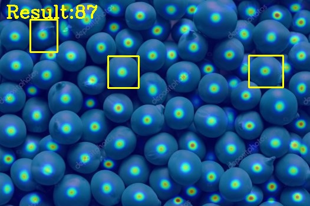
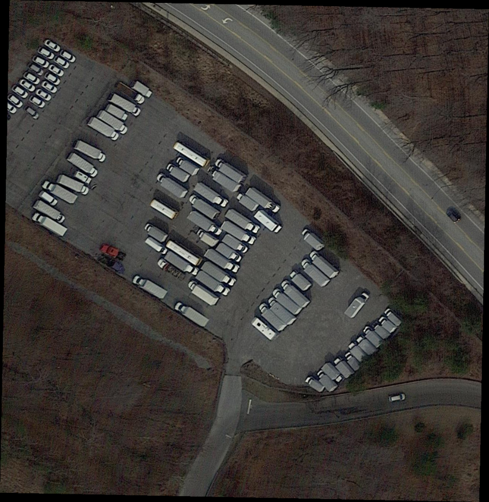
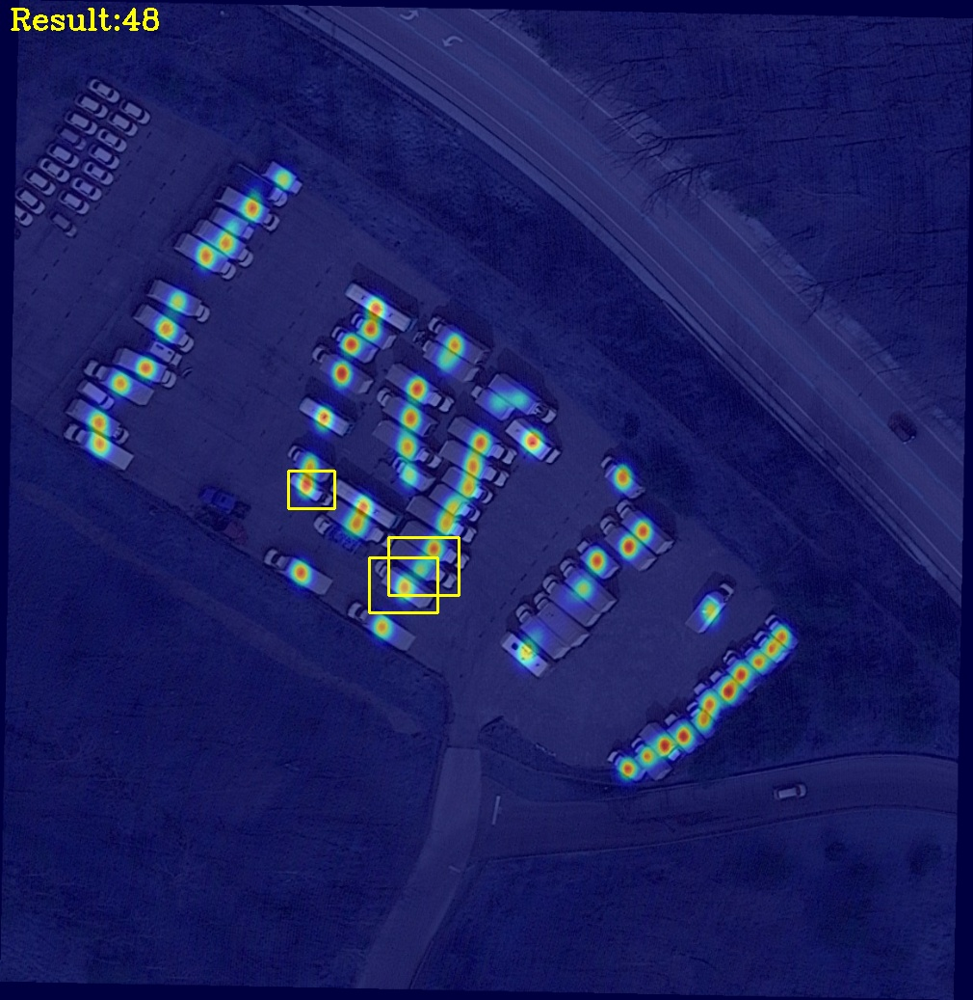
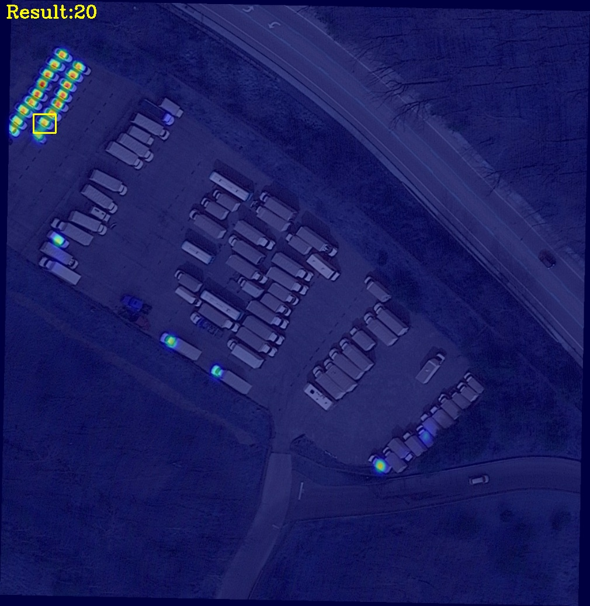

# DSALVANet

This is the code for Few-Shot Object Counting with Dynamic Similarity-Aware in Latent Space.
<div align=center>
    
</div>

<div align=center>
    
</div>


Dependencies
---
We are good in the environment:

- python $\geqslant$ 3.7

- numpy 1.23.5

- torch 2.0.1

- torchvision 0.15.2

- opencv 3.4.10

Installation
---

- To install the required packages, please run:
```
pip install -r requirements.txt
```

Pre-trained models
---
- To test the code, you can download the FSC147 pre-trained model of DSALVANet: 
[checkpoint_200.pth](https://drive.google.com/drive/folders/1DsAot2IpdnqkNjRV6gDaKdtpHf7WJQRz?usp=sharing)

Usage
---
- We provide the test code for our model. 
- Modify the path of input data and pre-trained model for testing.

```
python test.py -w ./checkpoints/checkpoint_200.pth -i ./test_data/4297.jpg -b ./test_data/4297.txt
```
- Finally, the model will output a result with count values and visualization in './output' folder.

Others
---
We will release more details of DSALVANet after the paper is officially publiced in the journal. 

Before that, if you have any questions, you can contact me via email: kadvinj@outlook.com.

